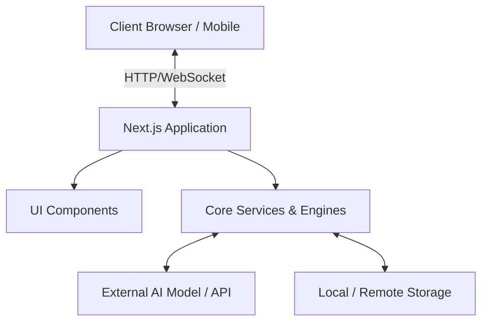
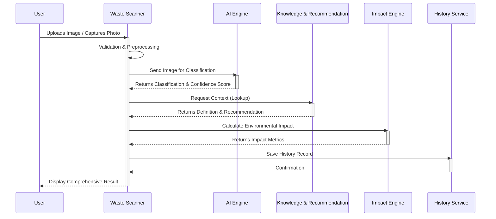

# EcoVision AI Architecture Documentation

## Architecture Overview

EcoVision AI is designed as a modern, responsive, and highly decoupled web application using Next.js. The architecture leverages server-side rendering (SSR) and static site generation (SSG) alongside rich client-side interactivity to deliver a seamless and performant user experience.

The core of the system is the AI Classification pipeline, which acts as the central hub connecting user inputs (images) to educational content and actionable recommendations. The architecture is modular, separating concerns between UI presentation, business logic, state management, and external service integrations.

### High-Level System Architecture

---

## Modules

The application is divided into several specialized modules, each handling a specific domain of the system:

1. **Landing Module**
   Handles the public-facing entry point of the application. It focuses on marketing, communicating the vision, and providing a gateway to the main application features with high visual fidelity and performance.

2. **Waste Scanner Module**
   The primary interaction point for users. It manages camera access, file uploads, image preprocessing (resizing, format conversion), and provides real-time feedback during the scanning process.

3. **AI Classification Engine**
   The core service responsible for interacting with AI models (vision APIs or local lightweight models). It processes the image, handles timeouts, and normalizes the output to extract the classification and the associated confidence score.

4. **Knowledge Engine**
   A specialized module that maps the raw classification result to a rich database of educational content. It provides definitions, material composition, and environmental context about the identified waste.

5. **Recommendation Engine**
   Based on the output from the Knowledge Engine and AI Classification, this module generates actionable steps. It provides sorting guidelines (e.g., "Yellow Bin", "Wash before recycling") based on best practices or local regulations.

6. **Environmental Impact Engine**
   Calculates the ecological footprint of the action. It translates the identified waste into metrics like CO2 offset, landfill space saved, or energy conserved to gamify and encourage recycling.

7. **History Module**
   Manages the persistence of user scans. It tracks past classifications, allowing users to review their recycling journey and accumulated environmental impact over time.

8. **Dashboard Module**
   Aggregates data from the History and Environmental Impact engines to present a holistic view of the user's contributions through charts, statistics, and achievement badges.

---

## Folder Responsibility

The `src` directory is organized to enforce separation of concerns and maintainability:

- **`src/app/`**: Contains the Next.js App Router configuration. It holds all the pages, layouts, and global routing logic. This is where the React tree begins.
- **`src/components/`**: Houses reusable React components (e.g., buttons, cards, navbars, modals). These are strictly presentation components that should be as stateless as possible.
- **`src/hooks/`**: Custom React hooks for encapsulating complex stateful logic and side effects (e.g., `useCamera`, `useClassification`, `useLocalStorage`).
- **`src/lib/`**: Contains utility functions, helpers, and configurations that are used across the application. This includes formatting tools, constants, and shared types.
- **`src/services/`**: Encapsulates external integrations and core business logic (the "Engines"). This is where API calls to AI models or database interactions are defined, keeping the components clean.
- **`src/styles/`**: Contains global CSS, Tailwind configurations, or custom style definitions that are not handled inline or via Tailwind utility classes.
- **`src/types/`**: Holds TypeScript interfaces and type aliases. Defining global types here ensures type safety and consistency across the entire codebase.

---

## Data Flow

The core workflow of EcoVision AI is the waste scanning and classification process. The following diagram illustrates the lifecycle of a scan from user input to the final result presentation.

### Detailed Flow Steps:

1. **User uploads image**: User interacts with the UI to capture or upload a photo of the waste.
2. **Validation**: The system checks file size, format, and performs basic preprocessing.
3. **AI Classification**: The image is sent to the AI Classification Engine.
4. **Confidence Score**: The AI returns the identified item along with a confidence threshold (e.g., 85% certain it is a PET bottle).
5. **Knowledge Lookup**: The Knowledge Engine retrieves educational details about the identified item.
6. **Recommendation**: The Recommendation Engine provides specific sorting instructions.
7. **Impact Calculation**: The Environmental Impact Engine computes the CO2 and energy saved by recycling this specific item.
8. **Save History**: The aggregated data is persisted to the user's local history or database.
9. **Display Result**: The UI renders the complete analysis to the user in an engaging format.

---

## Future Scalability

While the current architecture serves the initial phase, it is designed to scale and support advanced features in the future:

- **Authentication**: Implementing OAuth (e.g., via NextAuth.js or Clerk) to allow users to create accounts, save profiles, and sync data across devices.
- **Cloud Database**: Transitioning from local storage/mock data to a robust cloud database (like PostgreSQL or MongoDB via Prisma/Drizzle) to support scalable data persistence and analytics.
- **Multi-language (i18n)**: Integrating internationalization frameworks (like `next-intl`) to support multiple languages, broadening the educational reach.
- **Admin Dashboard**: Creating a secured `/admin` route for system administrators to monitor usage analytics, AI performance, and manage the knowledge database.
- **Offline AI**: Migrating from cloud-based AI APIs to local inference (e.g., using TensorFlow.js or ONNX Runtime Web) to allow the scanner to work completely offline, increasing accessibility and reducing latency.

---

## Responsible AI

EcoVision AI prioritizes ethical and responsible use of Artificial Intelligence. The system is built around the following principles:

- **Human Verification**: The AI acts as an assistant, not an absolute authority. Users are always encouraged to verify the result before taking action.
- **Confidence Threshold**: Predictions are always displayed with their confidence score. If the score falls below a certain threshold (e.g., < 60%), the system explicitly flags the result as uncertain and requests the user to retake the photo or manually select the waste type.
- **Transparency**: The application strives to explain *why* a classification was made (e.g., "Identified as plastic due to transparency and shape characteristics") whenever the underlying model supports it.
- **Educational-first approach**: The primary goal is to educate the user, not just automate the sorting process. Every scan is a learning opportunity about environmental impact.
- **Limitations of AI**: The UI explicitly communicates that AI models can make mistakes, especially with obscured, crumpled, or mixed waste, managing user expectations appropriately.
